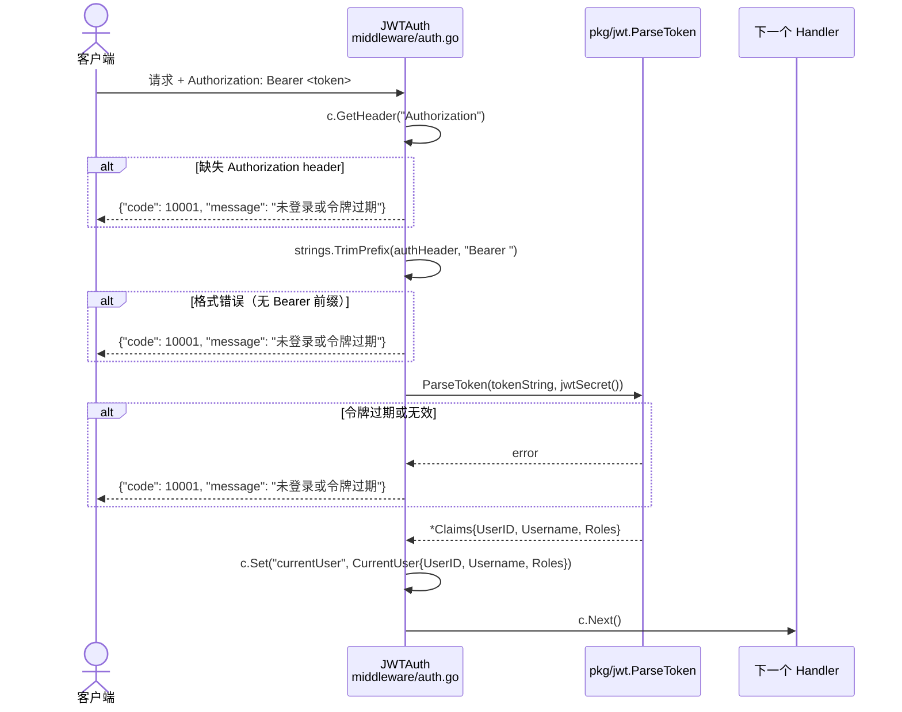
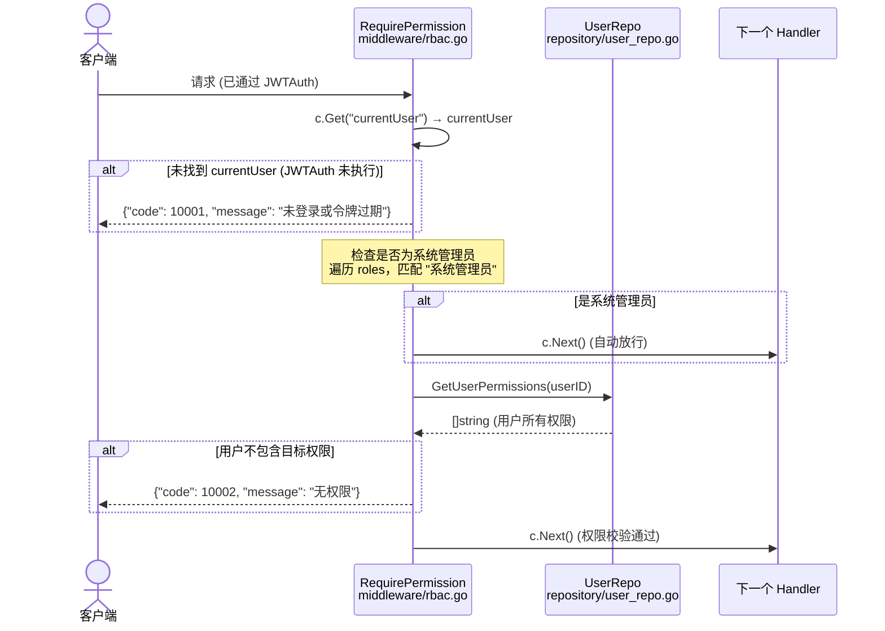
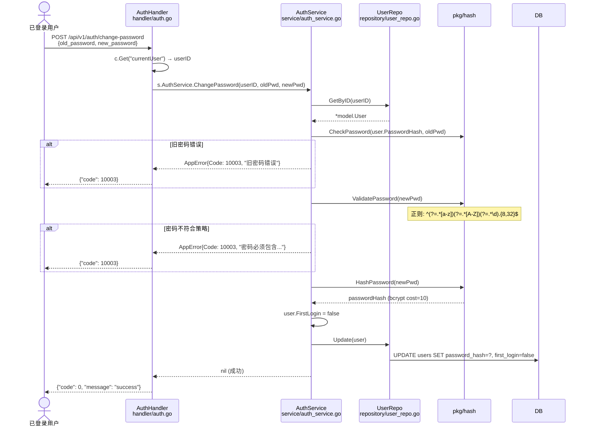
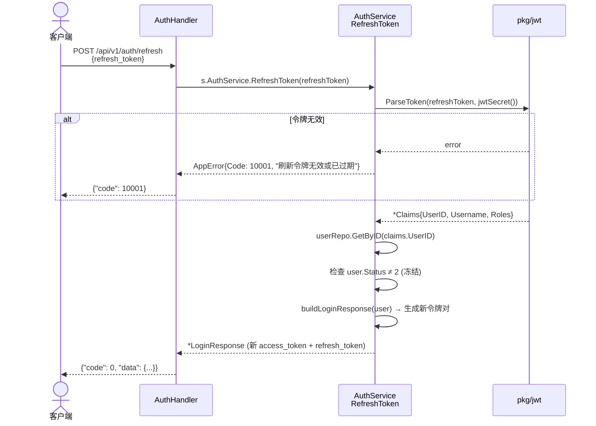

# 认证与授权流程 (Authentication & Authorization Flow)

> **涉及文件：** `handler/auth.go` → `service/auth_service.go` → `repository/user_repo.go` → `pkg/jwt/` → `pkg/hash/`
> **中间件：** `middleware/auth.go` (JWTAuth), `middleware/rbac.go` (RequirePermission)

---

## 1. 用户登录完整流程

```mermaid
sequenceDiagram
    actor U as 用户 (浏览器)
    participant H as AuthHandler<br/>handler/auth.go
    participant S as AuthService<br/>service/auth_service.go
    participant R as UserRepo<br/>repository/user_repo.go
    participant J as pkg/jwt
    participant B as pkg/hash
    participant DB as PostgreSQL

    U->>H: POST /api/v1/auth/login<br/>{username, password}
    H->>H: c.ShouldBindJSON(&LoginRequest)
    H->>S: s.AuthService.Login(username, password)
    
    S->>R: GetByUsername(username)
    R->>DB: SELECT * FROM users WHERE username = ?
    DB-->>R: user row
    R-->>S: *model.User
    
    alt 用户不存在
        S-->>H: AppError{Code: 10003, "用户名或密码错误"}
        H-->>U: {"code": 10003, "message": "用户名或密码错误"}
    end
    
    S->>B: CheckPassword(user.PasswordHash, password)
    alt 密码错误
        S-->>H: AppError{Code: 10003, "用户名或密码错误"}
        H-->>U: {"code": 10003, "message": "用户名或密码错误"}
    end
    
    alt 账号已冻结 (status=2)
        S-->>H: AppError{Code: 10002, "账号已被冻结"}
        H-->>U: {"code": 10002, "message": "账号已被冻结"}
    end
    
    S->>S: buildLoginResponse(user)
    
    rect rgb(30, 40, 60)
        Note over S,DB: buildLoginResponse 内部调用链
        S->>R: GetUserRoles(userID)
        R->>DB: SELECT r.* FROM roles r<br/>JOIN user_roles ur ON r.id = ur.role_id<br/>WHERE ur.user_id = ?
        DB-->>R: []Role
        R-->>S: []Role
        
        S->>R: GetUserPermissions(userID)
        R->>DB: 聚合所有角色的 permissions JSONB
        DB-->>R: []string (permissions)
        R-->>S: []string
        
        S->>S: buildMenuTree(userID, roles)
        Note over S: 系统管理员 → ListMenus() 全量<br/>其他角色 → 按角色聚合 + 去重
        
        S->>J: GenerateAccessToken(userID, username, roles, secret, 2h)
        J-->>S: accessToken (JWT)
        
        S->>J: GenerateRefreshToken(userID, username, roles, secret, 7d)
        J-->>S: refreshToken (JWT)
    end
    
    S-->>H: *LoginResponse{AccessToken, RefreshToken, User, Roles, Permissions, Menus}
    H-->>U: {"code": 0, "data": {access_token, refresh_token, user, roles, permissions, menus}}
```

---

## 2. JWT 认证中间件

---

## 3. RBAC 权限中间件

---

## 4. 修改密码流程

---

## 5. 令牌刷新流程

