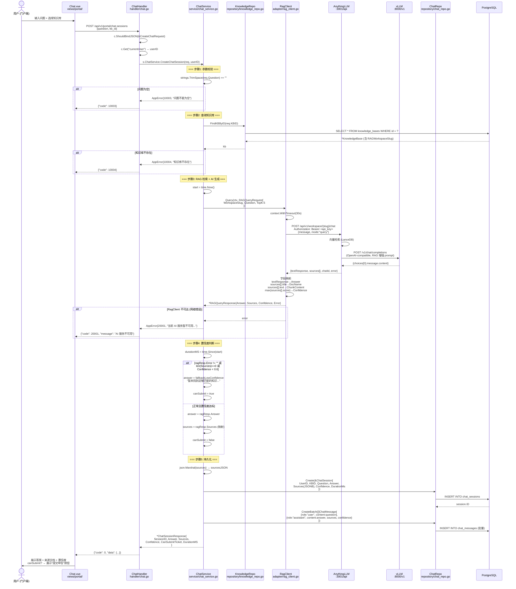
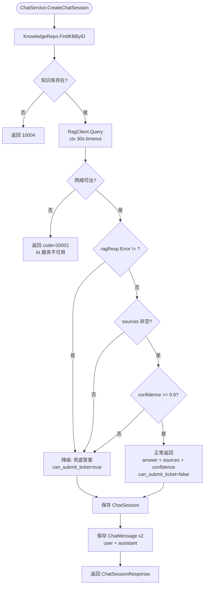
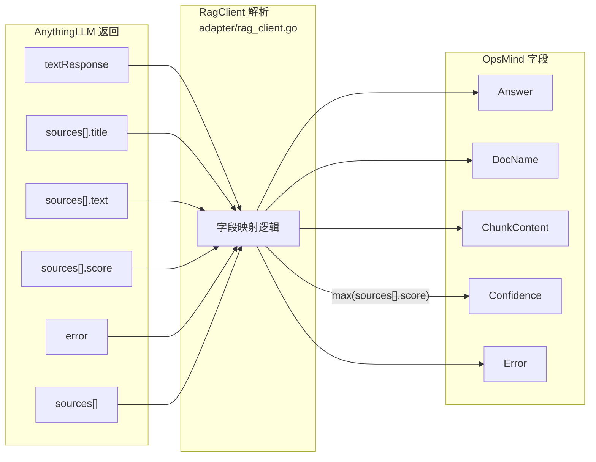
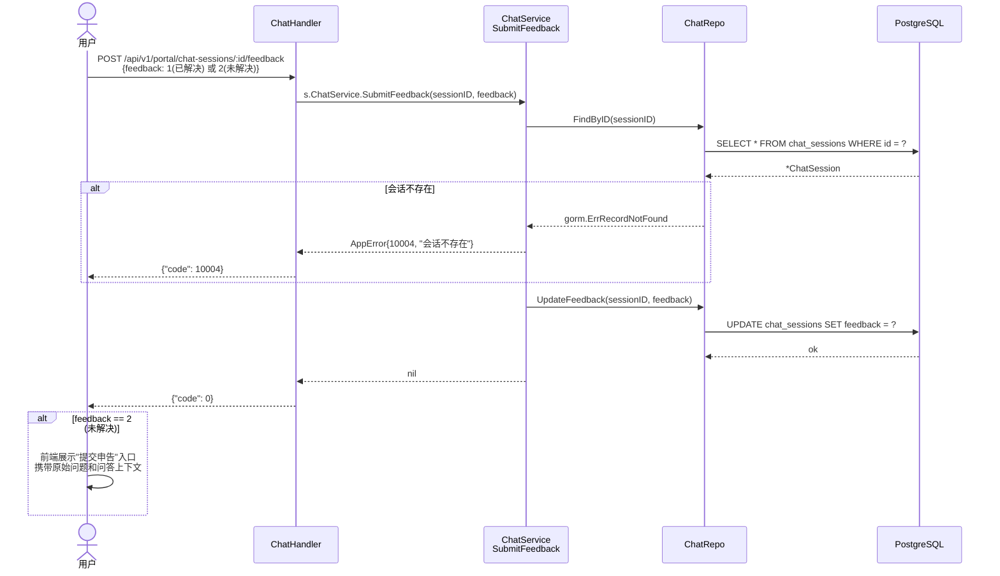

# 智能问答 RAG 流程 (Smart Q&A with RAG Pipeline)

> **涉及文件：** `handler/chat.go` → `service/chat_service.go` → `adapter/rag_client.go` → AnythingLLM → vLLM
> **降级规则：** 与 ANYTHINGLLM_AI_INTEGRATION.md §7.1 完全对齐

---

## 1. 完整问答链路（含降级分支）

---

## 2. 降级决策树

---

## 3. RagClient 字段映射（AnythingLLM → OpsMind）

---

## 4. 问答反馈流程

