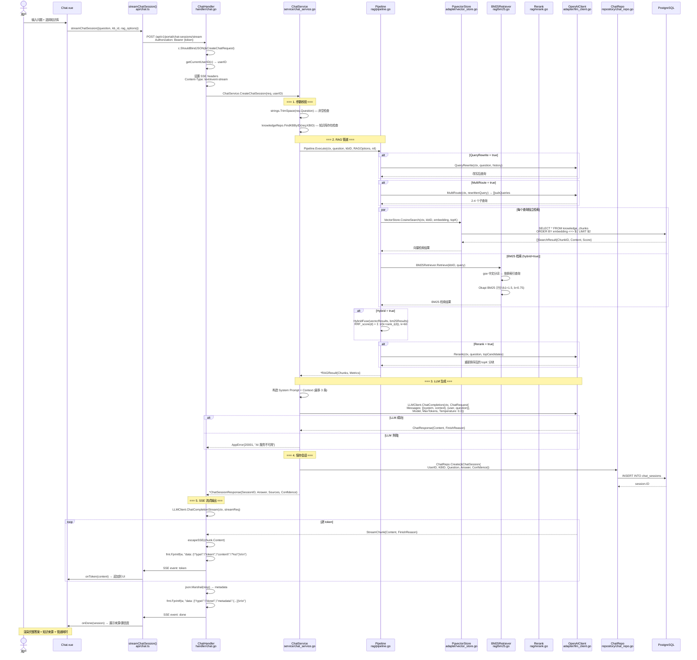
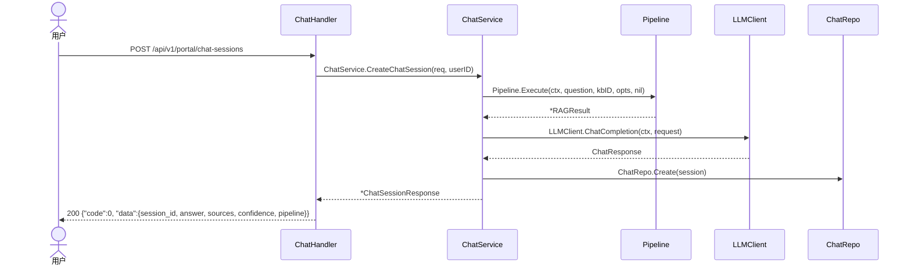
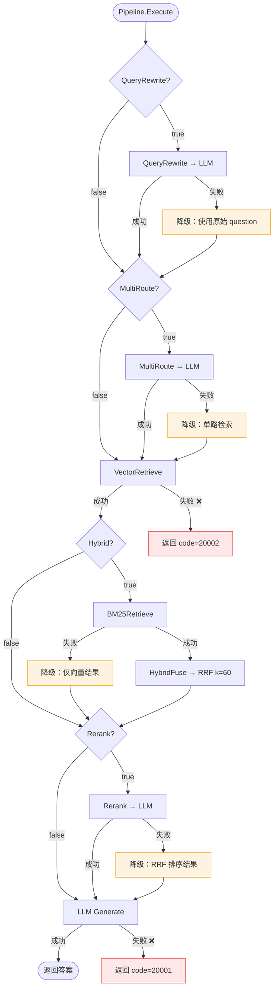

# 智能问答 RAG 管道流程

> 涉及文件：`handler/chat.go` → `service/chat_service.go` → `rag/pipeline.go` → `adapter/llm_client.go`
> 管道：查询改写 → 多路检索 → 向量检索 → BM25检索 → RRF融合 → 重排序 → LLM生成

## 1. 完整 SSE 流式问答链路

## 2. 非流式（同步）问答

## 3. 降级矩阵

