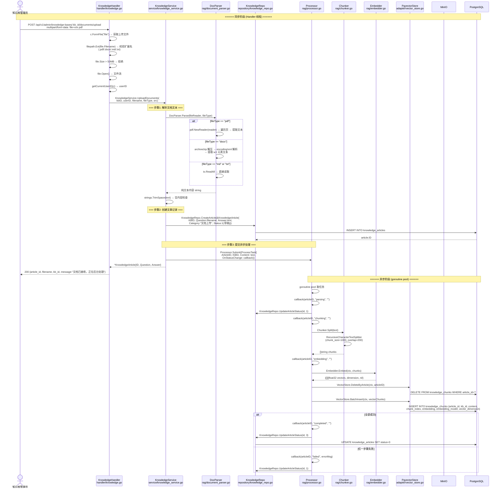
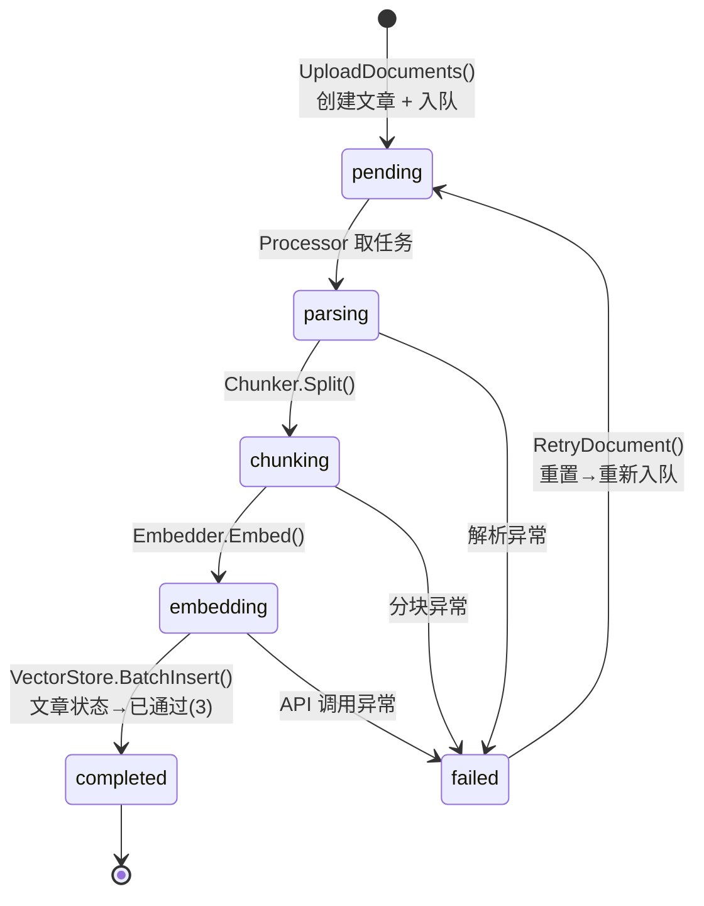

# 文档上传与异步处理流程

> 涉及文件：`handler/knowledge.go` → `service/knowledge_service.go` → `rag/document_parser.go` / `rag/chunker.go` / `rag/embedder.go` / `rag/processor.go`

## 1. 完整上传→处理链路



## 2. 处理状态流转



## 3. 支持的文件格式

```mermaid
flowchart LR
    Upload["UploadDocuments()"] --> Ext{filepath.Ext}
    Ext -->|".pdf"| PDF["DocParser.Parse(reader, \"pdf\")<br/>pdf.NewReader → 遍历页提取文本"]
    Ext -->|".docx"| DOCX["DocParser.Parse(reader, \"docx\")<br/>archive/zip → encoding/xml"]
    Ext -->|".md"| MD["DocParser.Parse(reader, \"md\")<br/>io.ReadAll 直接读取"]
    Ext -->|".txt"| TXT["DocParser.Parse(reader, \"txt\")<br/>io.ReadAll 直接读取"]
    Ext -->|其他| Reject["返回 10003<br/>不支持的文件格式"]

    PDF --> Text["纯文本 string"]
    DOCX --> Text
    MD --> Text
    TXT --> Text
    Text --> Article["CreateArticle()"]
```
