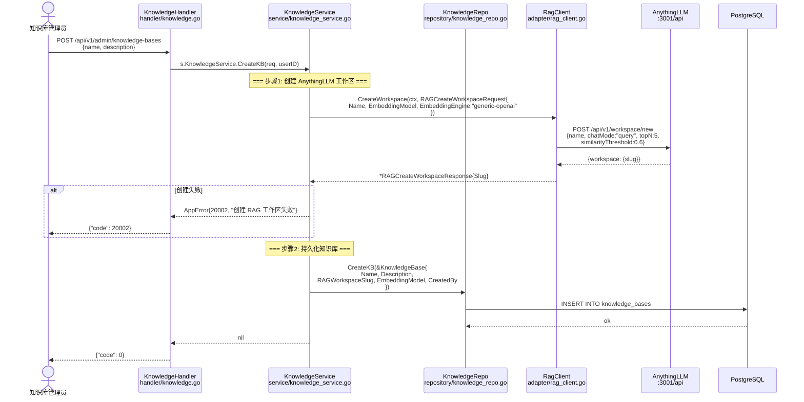
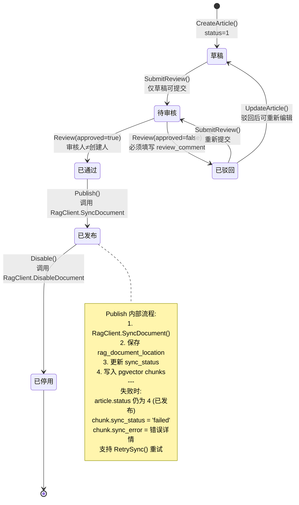
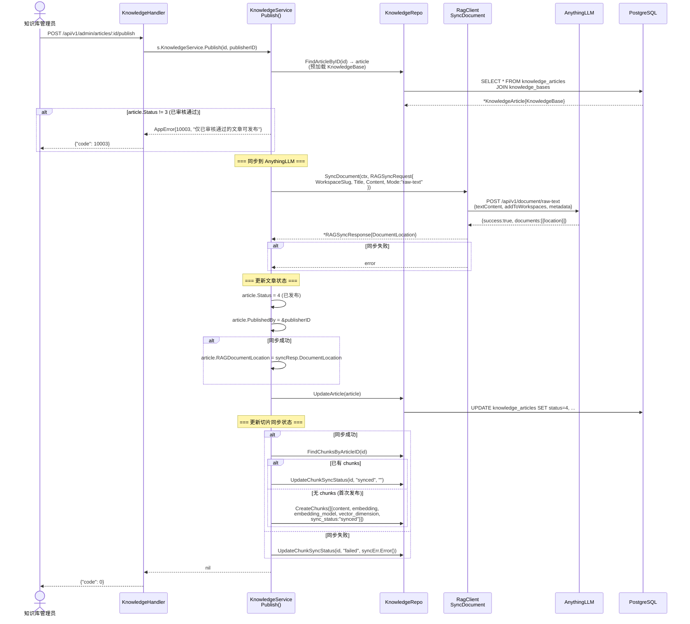
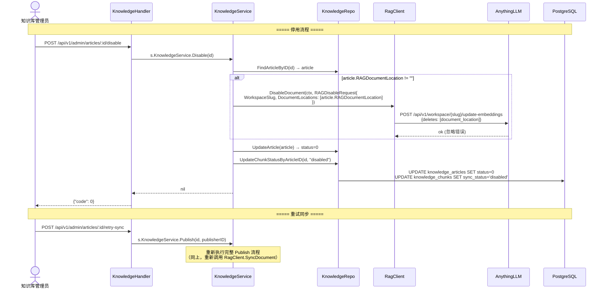
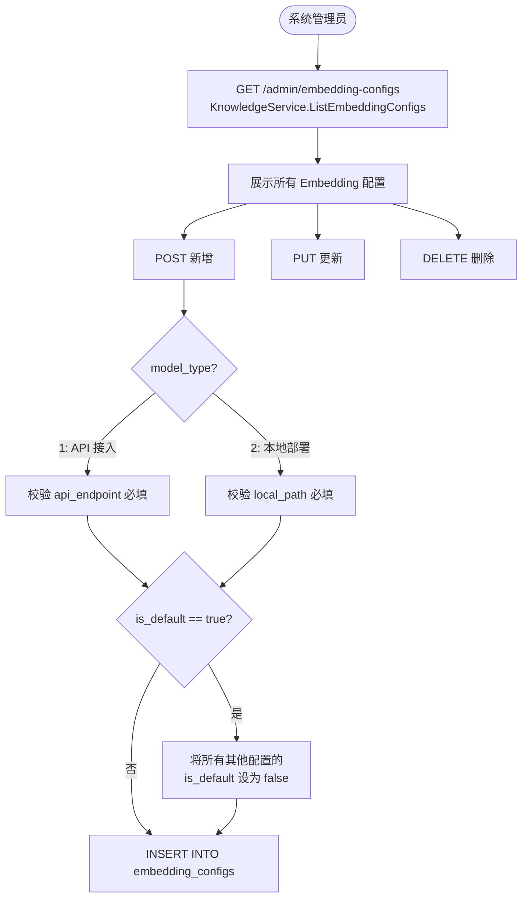

# 知识发布与同步流程 (Knowledge Publish & Sync Flow)

> **涉及文件：** `handler/knowledge.go` → `service/knowledge_service.go` → `adapter/rag_client.go` → AnythingLLM
> **同步状态：** pending → synced / failed / disabled

---

## 1. 知识库创建流程

---

## 2. 知识文章完整生命周期

---

## 3. 发布同步详细流程

---

## 4. 停用与重试流程

---

## 5. Embedding 配置管理

