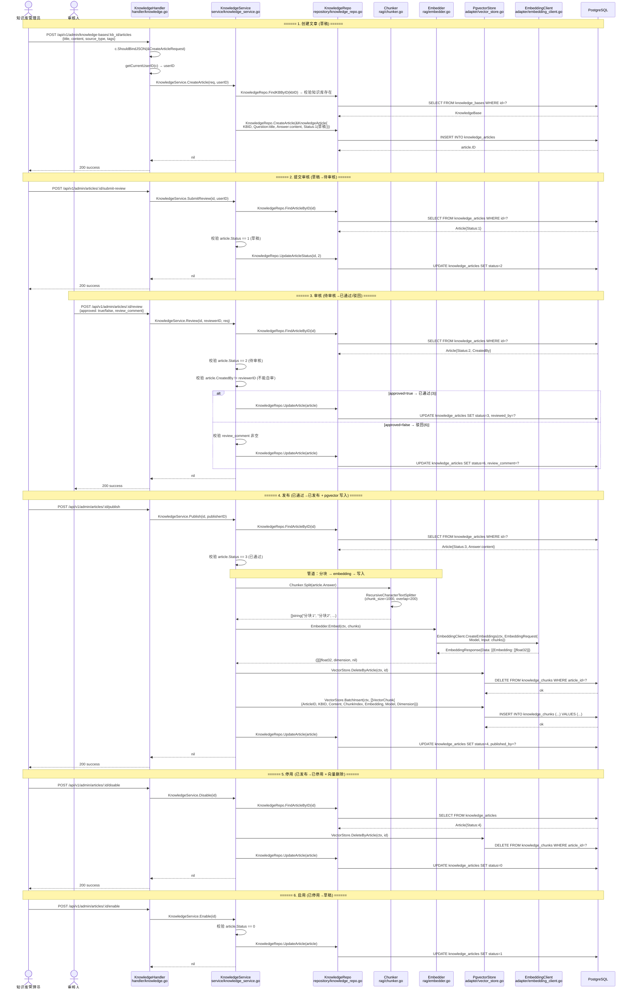
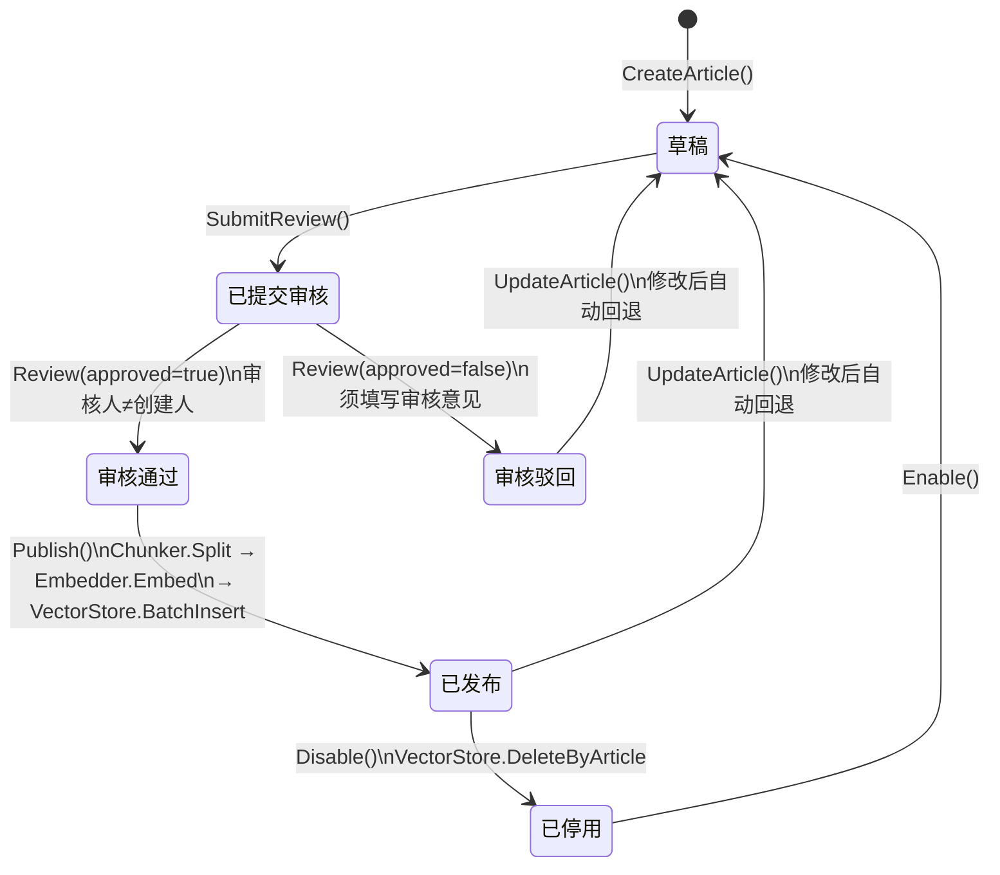

# 知识文章生命周期

> 涉及文件：`handler/knowledge.go` → `service/knowledge_service.go` → `rag/chunker.go` / `rag/embedder.go` / `adapter/vector_store.go`

## 1. 完整生命周期（创建→发布→停用）

```mermaid
sequenceDiagram
    actor A as 知识库管理员
    actor R as 审核人
    participant KH as KnowledgeHandler<br/>handler/knowledge.go
    participant KS as KnowledgeService<br/>service/knowledge_service.go
    participant KR as KnowledgeRepo<br/>repository/knowledge_repo.go
    participant CH as Chunker<br/>rag/chunker.go
    participant EM as Embedder<br/>rag/embedder.go
    participant VS as PgvectorStore<br/>adapter/vector_store.go
    participant EC as EmbeddingClient<br/>adapter/embedding_client.go
    participant DB as PostgreSQL

    Note over A,DB: ====== 1. 创建文章 (草稿) ======
    A->>KH: POST /api/v1/admin/knowledge-bases/:kb_id/articles<br/>{title, content, source_type, tags}
    KH->>KH: c.ShouldBindJSON(&CreateArticleRequest)
    KH->>KH: getCurrentUserID(c) → userID
    KH->>KS: KnowledgeService.CreateArticle(req, userID)
    KS->>KR: KnowledgeRepo.FindKBByID(kbID) → 校验知识库存在
    KR->>DB: SELECT FROM knowledge_bases WHERE id=?
    DB-->>KR: KnowledgeBase
    KS->>KR: KnowledgeRepo.CreateArticle(&KnowledgeArticle{<br/>  KBID, Question:title, Answer:content, Status:1(草稿)})
    KR->>DB: INSERT INTO knowledge_articles
    DB-->>KR: article.ID
    KS-->>KH: nil
    KH-->>A: 200 success

    Note over A,DB: ====== 2. 提交审核 (草稿→待审核) ======
    A->>KH: POST /api/v1/admin/articles/:id/submit-review
    KH->>KS: KnowledgeService.SubmitReview(id, userID)
    KS->>KR: KnowledgeRepo.FindArticleByID(id)
    KR->>DB: SELECT FROM knowledge_articles WHERE id=?
    DB-->>KR: Article{Status:1}
    KS->>KS: 校验 article.Status == 1 (草稿)
    KS->>KR: KnowledgeRepo.UpdateArticleStatus(id, 2)
    KR->>DB: UPDATE knowledge_articles SET status=2
    KS-->>KH: nil
    KH-->>A: 200 success

    Note over R,DB: ====== 3. 审核 (待审核→已通过/驳回) ======
    R->>KH: POST /api/v1/admin/articles/:id/review<br/>{approved: true/false, review_comment}
    KH->>KS: KnowledgeService.Review(id, reviewerID, req)
    KS->>KR: KnowledgeRepo.FindArticleByID(id)
    KR->>DB: SELECT FROM knowledge_articles WHERE id=?
    DB-->>KR: Article{Status:2, CreatedBy}
    KS->>KS: 校验 article.Status == 2 (待审核)
    KS->>KS: 校验 article.CreatedBy != reviewerID (不能自审)

    alt approved=true → 已通过(3)
        KS->>KR: KnowledgeRepo.UpdateArticle(article)
        KR->>DB: UPDATE knowledge_articles SET status=3, reviewed_by=?
    else approved=false → 驳回(6)
        KS->>KS: 校验 review_comment 非空
        KS->>KR: KnowledgeRepo.UpdateArticle(article)
        KR->>DB: UPDATE knowledge_articles SET status=6, review_comment=?
    end
    KS-->>KH: nil
    KH-->>R: 200 success

    Note over A,DB: ====== 4. 发布 (已通过→已发布 + pgvector 写入) ======
    A->>KH: POST /api/v1/admin/articles/:id/publish
    KH->>KS: KnowledgeService.Publish(id, publisherID)

    KS->>KR: KnowledgeRepo.FindArticleByID(id)
    KR->>DB: SELECT FROM knowledge_articles WHERE id=?
    DB-->>KR: Article{Status:3, Answer:content}
    KS->>KS: 校验 article.Status == 3 (已通过)

    Note over KS,EM: 管道：分块 → embedding → 写入
    KS->>CH: Chunker.Split(article.Answer)
    CH->>CH: RecursiveCharacterTextSplitter<br/>(chunk_size=1000, overlap=200)
    CH-->>KS: []string{"分块1", "分块2", ...}

    KS->>EM: Embedder.Embed(ctx, chunks)
    EM->>EC: EmbeddingClient.CreateEmbeddings(ctx, EmbeddingRequest{<br/>  Model, Input: chunks})
    EC-->>EM: EmbeddingResponse{Data: [{Embedding: []float32}]}
    EM-->>KS: ([][]float32, dimension, nil)

    KS->>VS: VectorStore.DeleteByArticle(ctx, id)
    VS->>DB: DELETE FROM knowledge_chunks WHERE article_id=?
    DB-->>VS: ok

    KS->>VS: VectorStore.BatchInsert(ctx, []VectorChunk{<br/>  {ArticleID, KBID, Content, ChunkIndex, Embedding, Model, Dimension}})
    VS->>DB: INSERT INTO knowledge_chunks (...) VALUES (...)
    DB-->>VS: ok

    KS->>KR: KnowledgeRepo.UpdateArticle(article)
    KR->>DB: UPDATE knowledge_articles SET status=4, published_by=?
    KS-->>KH: nil
    KH-->>A: 200 success

    Note over A,DB: ====== 5. 停用 (已发布→已停用 + 向量删除) ======
    A->>KH: POST /api/v1/admin/articles/:id/disable
    KH->>KS: KnowledgeService.Disable(id)
    KS->>KR: KnowledgeRepo.FindArticleByID(id)
    KR->>DB: SELECT FROM knowledge_articles
    DB-->>KR: Article{Status:4}
    KS->>VS: VectorStore.DeleteByArticle(ctx, id)
    VS->>DB: DELETE FROM knowledge_chunks WHERE article_id=?
    KS->>KR: KnowledgeRepo.UpdateArticle(article)
    KR->>DB: UPDATE knowledge_articles SET status=0
    KS-->>KH: nil
    KH-->>A: 200 success

    Note over A,DB: ====== 6. 启用 (已停用→草稿) ======
    A->>KH: POST /api/v1/admin/articles/:id/enable
    KH->>KS: KnowledgeService.Enable(id)
    KS->>KS: 校验 article.Status == 0
    KS->>KR: KnowledgeRepo.UpdateArticle(article)
    KR->>DB: UPDATE knowledge_articles SET status=1
    KS-->>KH: nil
```

## 2. 状态机总览

```mermaid
stateDiagram-v2
    [*] --> 草稿 : CreateArticle()
    草稿 --> 已提交审核 : SubmitReview()
    已提交审核 --> 审核通过 : Review(approved=true)\n审核人≠创建人
    已提交审核 --> 审核驳回 : Review(approved=false)\n须填写审核意见
    审核通过 --> 已发布 : Publish()\nChunker.Split → Embedder.Embed\n→ VectorStore.BatchInsert
    审核驳回 --> 草稿 : UpdateArticle()\n修改后自动回退
    已发布 --> 已停用 : Disable()\nVectorStore.DeleteByArticle
    已停用 --> 草稿 : Enable()
    已发布 --> 草稿 : UpdateArticle()\n修改后自动回退
```
