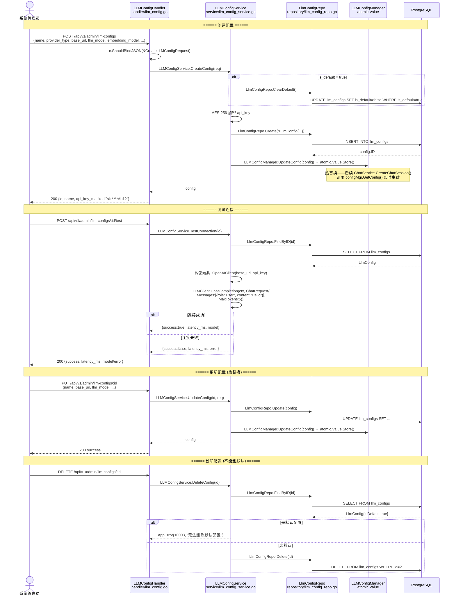
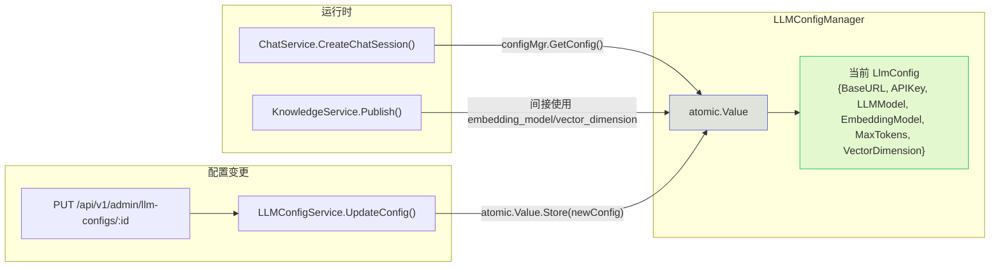
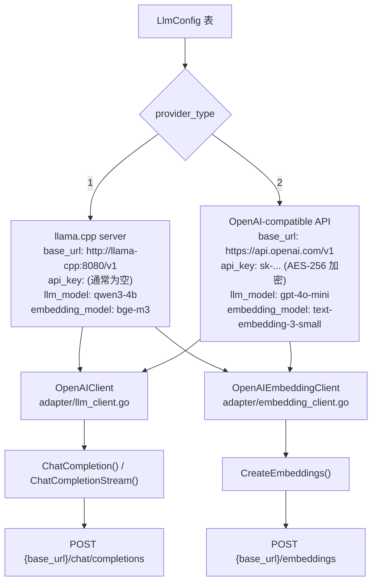

# LLM 配置管理流程

> 涉及文件：`handler/llm_config.go` → `service/llm_config_service.go` → `repository/llm_config_repo.go` + `adapter/llm_client.go`

## 1. 配置 CRUD + 热替换

```mermaid
sequenceDiagram
    actor A as 系统管理员
    participant LH as LLMConfigHandler<br/>handler/llm_config.go
    participant LS as LLMConfigService<br/>service/llm_config_service.go
    participant LR as LlmConfigRepo<br/>repository/llm_config_repo.go
    participant Mgr as LLMConfigManager<br/>atomic.Value
    participant DB as PostgreSQL

    Note over A,DB: ====== 创建配置 ======
    A->>LH: POST /api/v1/admin/llm-configs<br/>{name, provider_type, base_url, llm_model, embedding_model, ...}
    LH->>LH: c.ShouldBindJSON(&CreateLLMConfigRequest)
    LH->>LS: LLMConfigService.CreateConfig(req)

    alt is_default = true
        LS->>LR: LlmConfigRepo.ClearDefault()
        LR->>DB: UPDATE llm_configs SET is_default=false WHERE is_default=true
    end

    LS->>LS: AES-256 加密 api_key
    LS->>LR: LlmConfigRepo.Create(&LlmConfig{...})
    LR->>DB: INSERT INTO llm_configs
    DB-->>LR: config.ID

    LS->>Mgr: LLMConfigManager.UpdateConfig(config) → atomic.Value.Store()
    Note over Mgr: 热替换——后续 ChatService.CreateChatSession()<br/>调用 configMgr.GetConfig() 即时生效

    LS-->>LH: config
    LH-->>A: 200 {id, name, api_key_masked:"sk-****Ab12"}

    Note over A,DB: ====== 测试连接 ======
    A->>LH: POST /api/v1/admin/llm-configs/:id/test
    LH->>LS: LLMConfigService.TestConnection(id)
    LS->>LR: LlmConfigRepo.FindByID(id)
    LR->>DB: SELECT FROM llm_configs
    DB-->>LR: LlmConfig

    LS->>LS: 构造临时 OpenAIClient(base_url, api_key)
    LS->>LS: LLMClient.ChatCompletion(ctx, ChatRequest{<br/>  Messages:[{role:"user", content:"Hello"}],<br/>  MaxTokens:5})

    alt 连接成功
        LS-->>LH: {success:true, latency_ms, model}
    else 连接失败
        LS-->>LH: {success:false, latency_ms, error}
    end

    LH-->>A: 200 {success, latency_ms, model/error}

    Note over A,DB: ====== 更新配置 (热替换) ======
    A->>LH: PUT /api/v1/admin/llm-configs/:id<br/>{name, base_url, llm_model, ...}
    LH->>LS: LLMConfigService.UpdateConfig(id, req)
    LS->>LR: LlmConfigRepo.Update(config)
    LR->>DB: UPDATE llm_configs SET ...
    LS->>Mgr: LLMConfigManager.UpdateConfig(config) → atomic.Value.Store()
    LS-->>LH: config
    LH-->>A: 200 success

    Note over A,DB: ====== 删除配置 (不能删默认) ======
    A->>LH: DELETE /api/v1/admin/llm-configs/:id
    LH->>LS: LLMConfigService.DeleteConfig(id)
    LS->>LR: LlmConfigRepo.FindByID(id)
    LR->>DB: SELECT FROM llm_configs
    DB-->>LR: LlmConfig{IsDefault:true}
    alt 是默认配置
        LS-->>LH: AppError{10003, "无法删除默认配置"}
    else 非默认
        LS->>LR: LlmConfigRepo.Delete(id)
        LR->>DB: DELETE FROM llm_configs WHERE id=?
    end
```

## 2. 热替换机制

```mermaid
flowchart LR
    subgraph 运行时
        ChatSvc["ChatService.CreateChatSession()"]
        KnowSvc["KnowledgeService.Publish()"]
    end

    subgraph LLMConfigManager
        Atomic["atomic.Value"]
        Current["当前 LlmConfig<br/>{BaseURL, APIKey, LLMModel, EmbeddingModel, MaxTokens, VectorDimension}"]
    end

    subgraph 配置变更
        API["PUT /api/v1/admin/llm-configs/:id"]
        Update["LLMConfigService.UpdateConfig()"]
    end

    ChatSvc -->|"configMgr.GetConfig()"| Atomic
    KnowSvc -->|间接使用 embedding_model/vector_dimension| Atomic
    Atomic --> Current

    API --> Update
    Update -->|"atomic.Value.Store(newConfig)"| Atomic

    style Atomic fill:#5e6ad230,stroke:#5e6ad2
    style Current fill:#22c55e20,stroke:#22c55e
```

## 3. 提供商类型

```mermaid
flowchart TD
    Config["LlmConfig 表"] --> Type{provider_type}

    Type -->|1| LlamaCpp["llama.cpp server<br/>base_url: http://llama-cpp:8080/v1<br/>api_key: (通常为空)<br/>llm_model: qwen3-4b<br/>embedding_model: bge-m3"]

    Type -->|2| OpenAI["OpenAI-compatible API<br/>base_url: https://api.openai.com/v1<br/>api_key: sk-... (AES-256 加密)<br/>llm_model: gpt-4o-mini<br/>embedding_model: text-embedding-3-small"]

    LlamaCpp --> LLMClient["OpenAIClient<br/>adapter/llm_client.go"]
    OpenAI --> LLMClient

    LlamaCpp --> EmbClient["OpenAIEmbeddingClient<br/>adapter/embedding_client.go"]
    OpenAI --> EmbClient

    LLMClient --> Chat["ChatCompletion() / ChatCompletionStream()"]
    EmbClient --> Embed["CreateEmbeddings()"]

    Chat --> Endpoint["POST {base_url}/chat/completions"]
    Embed --> EmbedEP["POST {base_url}/embeddings"]
```
