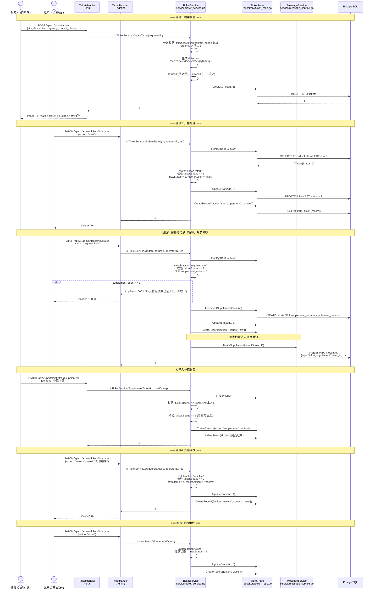
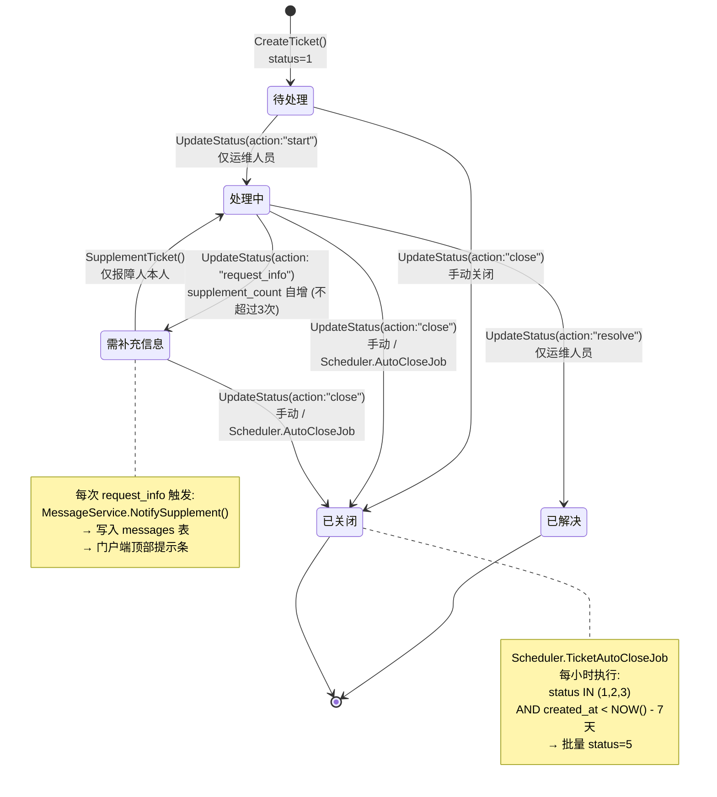
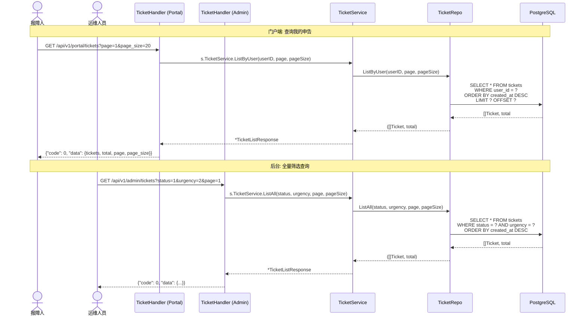

# 申告状态机与生命周期 (Ticket State Machine & Lifecycle)

> **涉及文件：** `handler/ticket.go` → `service/ticket_service.go` → `repository/ticket_repo.go`
> **调度器：** `service/scheduler.go` (TicketAutoCloseJob)
> **消息：** `service/message_service.go` (NotifySupplement)

---

## 1. 完整申告生命周期



---

## 2. 状态机转换图



---

## 3. 后台调度器：7 天自动关闭

```mermaid
flowchart TD
    Start([Scheduler.Start]) --> GoRoutine[go runAutoCloseLoop(ctx)]
    GoRoutine --> Ticker[time.NewTicker(1h)]
    
    Ticker --> Loop{收到 tick?}
    Loop -->|是| Query[TicketRepo.AutoCloseTickets(7天前)]
    Query --> SQL["SELECT ... FROM tickets<br/>WHERE status IN (1,2,3)<br/>AND created_at < NOW() - INTERVAL '7 days'"]
    SQL --> Update["UPDATE tickets SET status = 5<br/>WHERE ..."]
    Update --> Log["写入 audit_log<br/>action='auto_close'"]
    Log --> CheckCtx{ctx.Done()?}
    
    Loop -->|否| CheckCtx
    
    CheckCtx -->|否| Loop
    CheckCtx -->|是 (Scheduler.Stop)| Stop([退出 goroutine])
```

---

## 4. 申告查询流程（门户端/后台）


